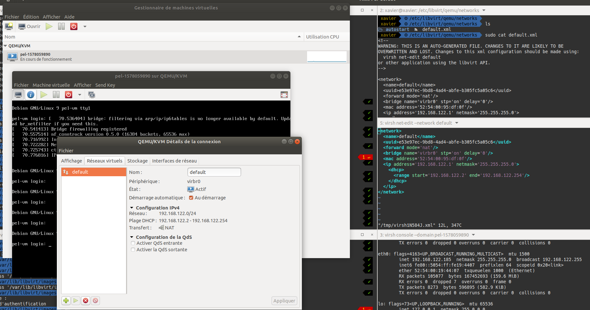

# Création d'une machine virtuelle

mardi 17 décembre 2019, 23:16:24 (UTC+0100)

## Récupération d'une image au format qcow2
```bash
curl -sL https://cdimage.debian.org/cdimage/openstack/10.2.0/debian-10.2.0-openstack-arm64.qcow2
```

## Création d'un layer qcow2
### Disque virtuel : **non** spécifié
```bash
qemu-img create -b debian-10.2.0-openstack-arm64.qcow2 -f qcow2 debian-arm64.qcow2
```
> (!) le fichier debian-arm64.qcow2 est généré là ou la commande a été lancée

### Disque virtuel : spécifié
```bash
qemu-img create -b debian-10.2.0-openstack-arm64.qcow2 -f qcow2 debian-arm64.qcow2 3G
```
> où l'on a spécifié la taille du disque virtuel fixée à 3G

```bash
user-debian@pel-vm:~$ df -h
Sys. de fichiers Taille Utilisé Dispo Uti% Monté sur
udev               992M       0  992M   0% /dev
tmpfs              201M    4,7M  196M   3% /run
/dev/vda1          3,0G    1,8G  998M  65% /
tmpfs             1003M       0 1003M   0% /dev/shm
tmpfs              5,0M       0  5,0M   0% /run/lock
tmpfs             1003M       0 1003M   0% /sys/fs/cgroup
tmpfs              201M       0  201M   0% /run/user/1001
```
> visible ici `/dev/vda1          3,0G    1,8G  998M  65% /`

## Configuration via cloud-init

- Prerequis : deux fichiers de configuration (pour la configuration de cloud-init)
  - meta-data
  ```
  instance-id: my-id
  local-hostname: my-hostname
  ```
  - user-data
  ```
  #cloud-config
  password: mypassword
  chpasswd: { expire: False }
  ssh_pwauth: True
  users:
  - default
  ```
  - SSH
  ```
  ssh_authorized_keys:
    - ssh-rsa <ma_clef_public>
  ```
  - Sources.list
  ```
  apt:
  primary:
    - arches: [default]
      uri: http://deb.debian.org/debian/
  sources_list: |
    deb $PRIMARY buster main
    deb $PRIMARY buster-updates main
    deb $PRIMARY buster-backports main
  conf: |
    APT {
      Get {
        Assume-Yes "true";
        Fix-Broken "true";
      };
    };
  packages:
   - [docker-ce, docker-ce-cli, containerd.io]
  ```

- Génération du volume cidata
```
genisoimage -output debian-arm64.iso -volid cidata -joliet -rock user-data meta-data
```

## Création d'une instance du modele de notre VM
```
virt-install \
  --noreboot \
  --import \
  --name debian-arm64-vm \
  --ram 2048 \
  --arch aarch64 \
  --vcpus 1 \
  --disk debian-arm64.qcow2,format=qcow2,bus=virtio \
  --disk debian-arm64.iso,device=cdrom \
  --network bridge=virbr0,model=virtio \
  --os-type=generic \
  --os-variant=generic \
  --noautoconsole
```

> instancie une vm

> `--noreboot` pour ne pas démarrer la vm lors de l'execution de la commande `virt-install [...]`

> `--name` pour définir le _domaine_ (le nom de la vm)

> Cette instance donne lieu à la création d'un fichier xml
> - dans le répertoire `/etc/libvirt/qemu`
> - nommé par la valeur suivant l'option `--name` _(qui est debian-arm64-vm dans notre exemple)_
>   - le nom du domaine peut-être consulté via la commande `virsh list --all`

# Controle

## Virtual manager
```
virt-manager
```


## Virsh
- `virsh list --all` pour lister les domaines (vm) et leurs status
- `virsh dominfo --domain <domain>` pour obtenir des informations détaillées sur la VM
- `virsh start <domain>` pour lancer une vm
- `virsh shutdown <domain>` pour arreter une vm
- `virsh destroy <domain>` pour forcer l'arret immediat d'une vm
- `virsh undefine --nvram <domain>` pour supprimer une vm
  - `virsh undefine --nvram <domain> --remove-all-storage` pour supprimer le domaine et **effacer** les disques associés
- `virsh dumpxml --domain <domain> > <mon_fichier>.xml` pour exporter la configuration du domain
- `virsh net-edit --network <nom_reseau_virtuel>` pour éditer la configuration réseau
  - nommé `<nom_reseau_virtuel>`
  - le répertoire `/etc/libvirt/qemu/networks` contient alors le fichier `<nom_reseau_virtuel>.xml`

# Configuration du réseau
_Utilisation de virsh_

- virsh net

```bash
 Name                 State      Autostart     Persistent
----------------------------------------------------------
 default              active     yes           yes
```

virsh net-dumpxml default >net-$(date +%s).xml

## Fichier de configuration

```
<network>
  <name>net1</name>
  <bridge name='virbr1' stp='on' delay='0'/>
  <mac address='00:00:00:01:FF:FE'/>
  <dns enable="no"/>
  <ip address='192.168.1.254' netmask='255.255.255.0' localPtr="yes">
    <dhcp>
      <range start='192.168.1.1' end='192.168.1.253'/>
      <host mac='00:00:00:01:00:01' name="vm1" ip='192.168.1.1'/>
      <host mac='00:00:00:01:00:02' name="vm2" ip='192.168.1.2'/>
      <host mac='00:00:00:01:00:03' name="vm3" ip='192.168.1.3'/>
      <host mac='00:00:00:01:00:04' name="vm4" ip='192.168.1.4'/>
      <host mac='00:00:00:01:00:05' name="vm5" ip='192.168.1.5'/>
      <host mac='00:00:00:01:00:06' name="vm6" ip='192.168.1.6'/>
      <host mac='00:00:00:01:00:07' name="vm7" ip='192.168.1.7'/>
    </dhcp>
  </ip>
</network>
```

# Remarques

## SSH (poste vers VM)
_Concernant la connexion ssh, on peut également_
- lancer la VM : `virsh start <nom_domain>`
- se connecter à la VM en mode interactif : `virsh console --domain <nom_domaine>`
- copier sa clef public `$HOME/.ssh/id_rsa.pub` de son poste de dev au sein de l'instance de la VM lancée `$HOME/.ssh/authorized_keys`

Connaitre ma clef **public** ssh sur mon poste
```
cat $HOME/.ssh/id_rsa.pub
```

> ssh-rsa AAAAB3[...]fyKjW/R9

Ajouter ma clef public sur la **VM** dans le fichier suivant `$HOME/.ssh/authorized_keys`


### Connexion SSH avec l'utilisateur distant **root** (celui de la VM)
```
(!) Pour pouvoir se connecter sur le compte root, on peut y parvenir en modifiant le fichier de configuration du serveur ssh sur la VM : /etc/ssh/sshd_config
```
Il faut
- décommenter la ligne suivante : `PermitRootLogin prohibit-password`
- relancer le daemon : `systemctl restart sshd.service`

## Docker
- _Guide d'installation pour la Debian 10 (buster)_
[installation docker](https://computingforgeeks.com/install-docker-and-docker-compose-on-debian-10-buster/)

## AppArmor
_Logiciel libre de sécurité permettant d'associer à chaque programme un profil de sécurité pouvant restreindre ses capacités._

- gestionnaire des droits d'accès sur les applications

> AppArmor ralentit considérablement le démarrage de la distribution Debian (avec de multiples tentatives)
- ```bash
  systemd-analyze blame | grep -i apparmor
  ```
  > 5.122s apparmor.service

> Le choix a donc été fait de le désactiver

### Désactiver AppArmor (au niveau kernel)
_Il faut écrire la ligne suivante dans un fichier nommé ***apparmor.cfg*** situé dans `/etc/default/grub.d`_
```
GRUB_CMDLINE_LINUX_DEFAULT="$GRUB_CMDLINE_LINUX_DEFAULT apparmor=0"
```
_(!) et activer la nouvelle configuration via la commande_
```bash
update-grub
```
