# Montage d'une machine virtuelle

lundi 16 décembre 2019, 09:47:38 (UTC+0100)

_Mise en place d'une machine virtuelle sur une distribution linux._
- installation des différents paquets, outils, ...
- configuration

## Préconditions
Les informations qui suivent partent de la distribution linux suivante (Ubuntu 18.04)

```bash
uname -a
```

Sortie
> Linux xavier 4.15.0-70-generic #79-Ubuntu SMP Tue Nov 12 10:36:11 UTC 2019 x86_64 x86_64 x86_64 GNU/Linux

Verifier que la distribution supporte la virutalisation matérielle
_Taper la commande_
```bash
kvm-ok
```

Sortie
> INFO: /dev/kvm exists

> KVM acceleration can be used


### Installer les paquets suivants
```bash
sudo apt install qemu libvirt-dev qemu-kvm virt-manager
```
- _qemu : hyperviseur de marchines virtuelles s'exécutant à l'interieur d'un autre système d'exploitation._
-- permet d'émuler le materiel, de simuler diverses architectures : x86, PPC, ARM, SPARC.
- virt-manager : gestionnaire de machines virtuelles en mode graphique permettant de gérer les machines virtuelles gérées par les hyperviseurs (tel kvm par exemple)

### Configuration
#### kvm
Il faut s'ajouter au groupe kvm
```bash
sudo adduser $USER kvm
```
Sortie
> kvm:x:128:xavier

ou $USER a pour valeur xavier dans cet exemple

### Lancement
```bash
virt-manager
```

L'erreur suivante apparait !!

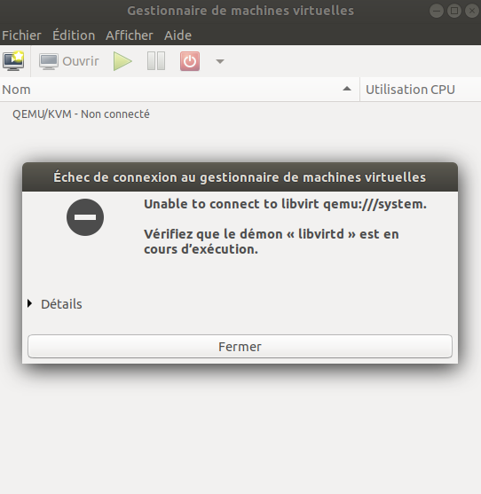

La commande suivante a été tapée
```bash
sudo systemctl enable libvirtd.service
```
- puis reboot de la machine
- puis relancer `virt-manager`

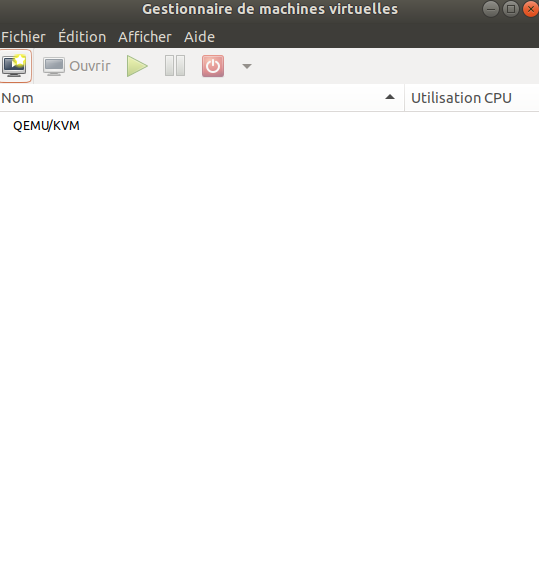

***

### Création d'une VM
- Architecture arch64
#### installation
```bash
sudo apt install qemu-efi-aarch64
```
- _UEFI firmware for 64-bit ARM virtual machines_

```bash
sudo apt install cloud-init
```
- outil (en python) de gestion de la configuration *initiale* des machines virtuelles
- permet de configurer les instances lors de leur premier démarrage
  - package ubuntu, framework permettant d'exécuter un script fourni lors de l'instanciation d'une VM
- (!) la mécanique permettant l'injection d'un script à l'environnement CloudInit doit-être supporté par l'API de la solution IaaS. Les APIs EC2 et OpenStack gèrent CloudInit.


```bash
sudo apt install python3-openstackclient
```
- permet de déployer des infrastructures de cloud computing
- permet la construction de clouds publics et privés
- permet de mettre en oeuvre des serveurs virtuels
- est capable de gérer CloudInit


#### récupération d'une image au format qcow2
- télécharger l'image
```bash
curl -sL https://cdimage.debian.org/cdimage/openstack/10.2.0/debian-10.2.0-openstack-arm64.qcow2
```
- _qcow2 : format d'image disque utilisé par qemu_
- _qcow vient de Qemu Copy On Write, optimise le stockage sur disque en retardant l'allocation de stockage jusqu'à ce que cela soit réellement nécessaire._

> Cette image permet d'être utilisée dans des environnements de type **cloud**, a fortiori OpenStack : c'est une cloud-enabled image

> OpenStack : propose une série de logiciels libres : Nova, Swift, Glance

##### lancement en mode console

- Prerequis : deux fichiers de configuration (pour la configuration de cloud-init)
  - meta-data :
  - user-data :

```bash
qemu-system-aarch64 -m 2G -M virt -cpu cortex-a53 -bios /usr/share/qemu-efi-aarch64/QEMU_EFI.fd -drive if=none,file=debian-10.2.0-openstack-arm64.qcow2,id=hd0 -device virtio-blk-device,drive=hd0 -nographic
```
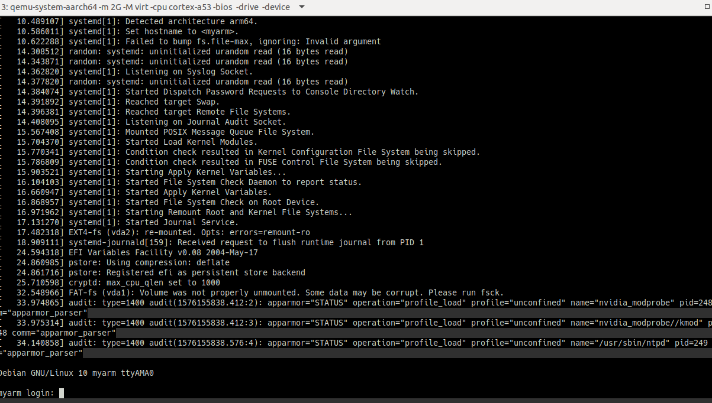

> login : root

> passwd : root

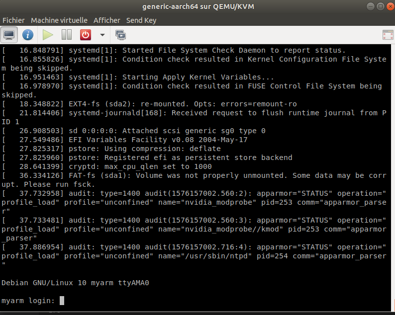

##### lancement en mode graphique
#### Etapes
```bash
virt-manager
```

> dans le menu :
> fichier > nouvelle machine virtuelle

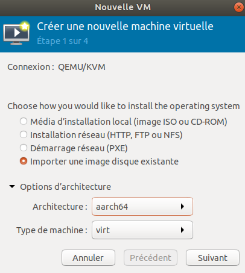

> _Attention de bien choisir l'architecture en adéquation avec l'image (qcow2)_

> faire : suivant
> rechercher dans l'arborescense le .qcow2 : debian-10.2.0-openstack-arm64.qcow2
> faire : ouvrir

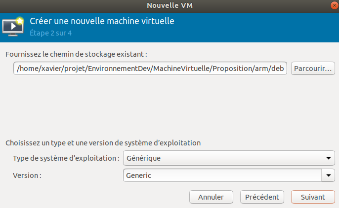

> _Le chemin de qcow2 est ici : /home/xavier/projet/EnvironnementDev/MachineVirtuelle/Proposition/arm/debian-10.2.0-openstack-arm64.qcow2_

> faire : suivant

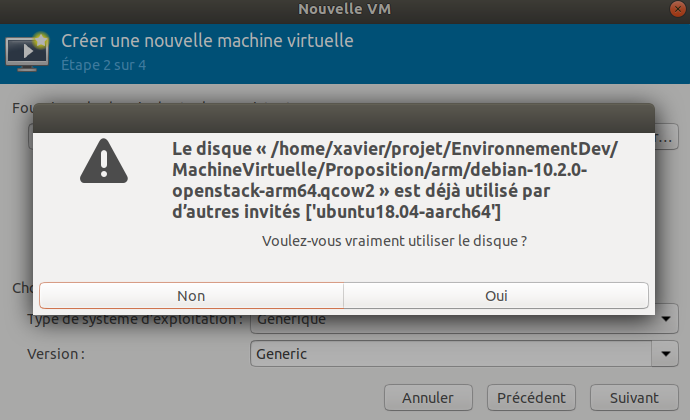

> cliquer : oui

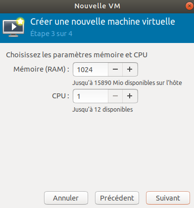

> faire : suivant

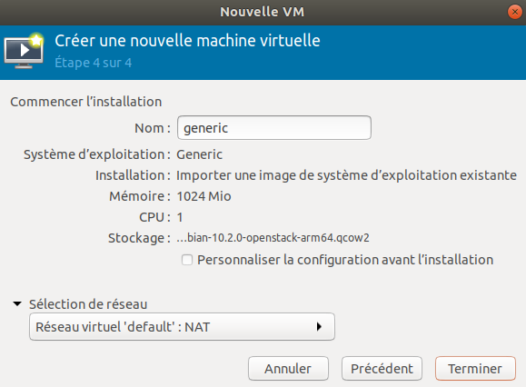

> sélectionner : terminer

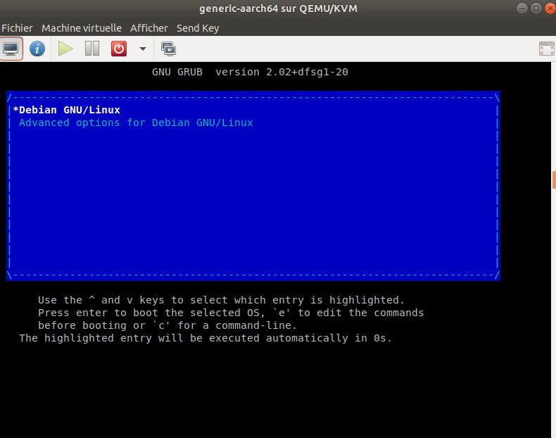

> _conserver la sélection sur debian_


> login : root

> passwd : root

##### Test
- Prerequis :
  - une image : debian-10.2.0-openstack-arm64.qcow2

_A partir de l'interface graphique virt-manager_

  - création d'une VM pour l'image debian-10.2.0-openstack-arm64.qcow2 que l'on nomme generic-aarch64
  - création d'un clone de la VM tout juste créée
    - faire : clique droit et choisir clone
    - nommer : generic-aarch64-clone

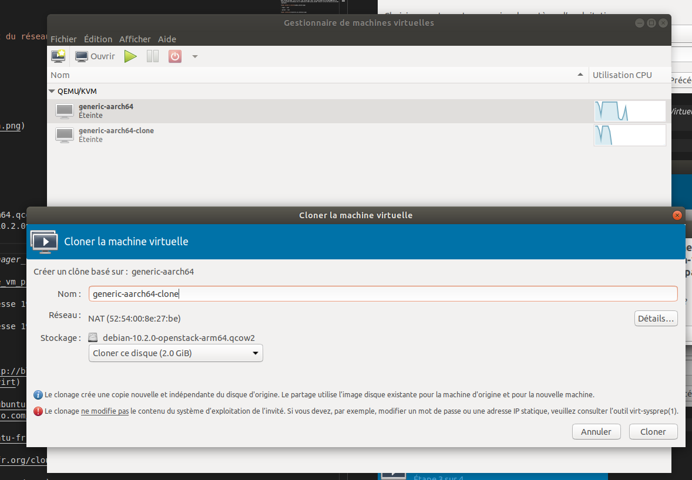

> lancer les deux VM : generic-aarch64 et generic-aarch64-clone

> en console : `ifconfig` pour repérer les adresses IP

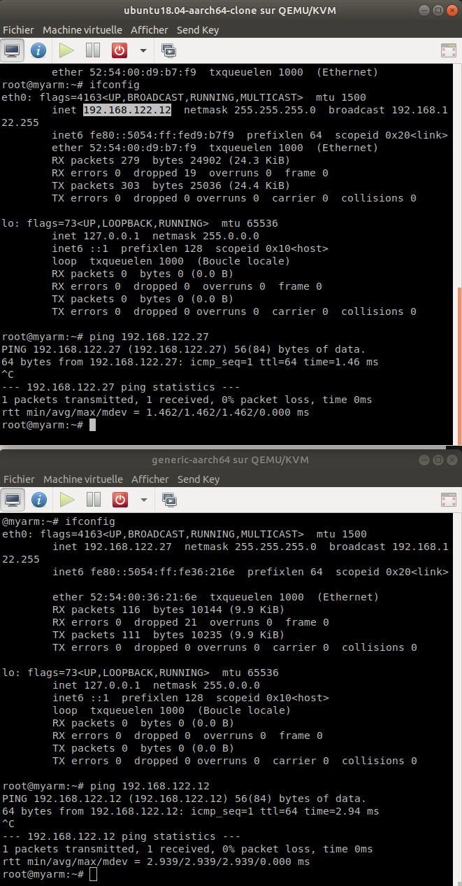

> `ping 192.168.122.12` depuis la VM d'adresse 192.168.122.27

> `ping 192.168.122.27` depuis la VM d'adresse 192.168.122.12

# Réseau
_Indépendamment de ce qui précède, on pourra noter concernant les interfaces réseaux que lors du lancement des deux VMs présentes dans la capture suivante la création automatique de deux interfaces_
> - vnet0
> - vnet1

  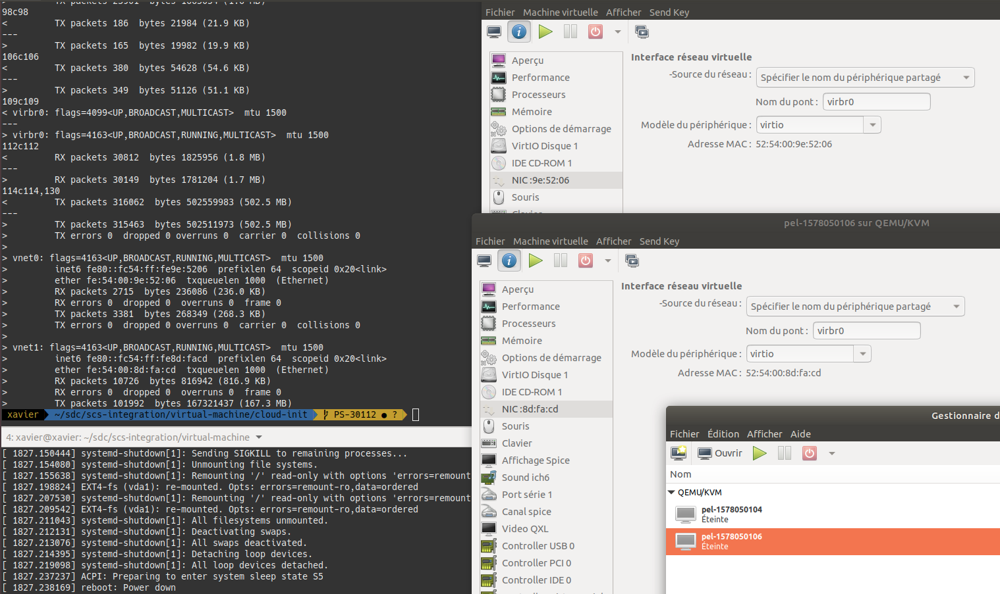

# Biblio
- libvirt
  - [booting cloud images with libvirt](http://blog.oddbit.com/post/2015-03-10-booting-cloud-images-with-libvirt)
- cloud-init
  - [cloud init ubuntu help](https://help.ubuntu.com/community/CloudInit)
  - [cloud init blog octo](https://blog.octo.com/cloudinit-kesako)
- openstack
  - [openstack ubuntu doc](https://doc.ubuntu-fr.org/openstack)
- cloud
  - [cloud ubuntu doc](https://doc.ubuntu-fr.org/cloud)
- qemu
  - [qemu ubuntu doc](https://doc.ubuntu-fr.org/qemu)
- virtualisation
  - [kvm](https://linux.goffinet.org/administration/virtualisation-kvm/)
- réseau
  - [tap](https://en.wikipedia.org/wiki/TUN/TAP)
